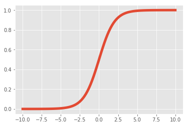
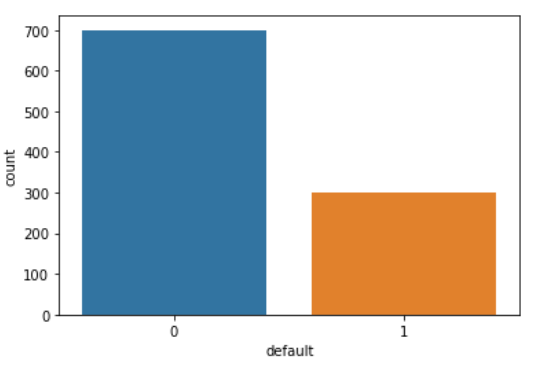
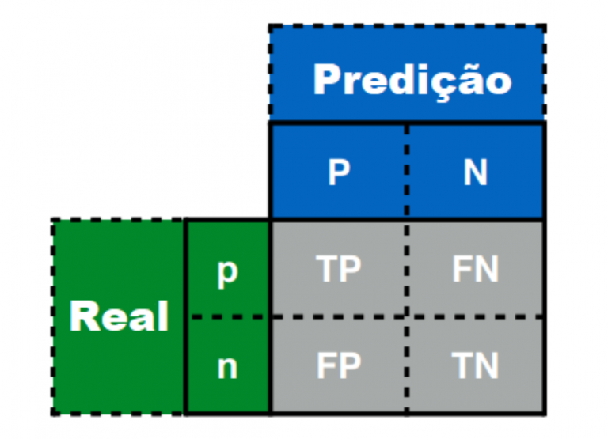
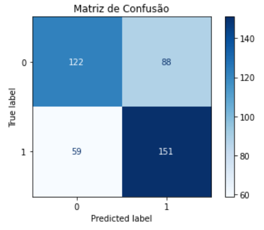
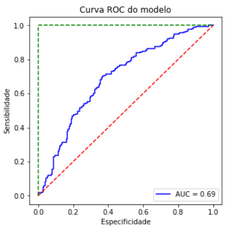
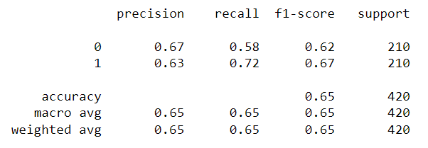

<h1 align='center'> Predição Credit Score de Banco </h1>

# Descrição do projeto

Um banco alemão está buscando melhorar a sua assertividade em emprestar dinheiro a clientes. Devido a isso, o gerente gostaria de desenvolver um algoritmo que prevê com 90% de assertividade se determinado cliente irá pagar o empréstimo. Para realizar esse estudo, utilizaremos a base de dados presentes no banco de dados da UCI, disponível no link: https://archive.ics.uci.edu/ml/datasets/statlog+(german+credit+data)

O projeto consiste em responder a seguinte pergunta: Dado alguns dados referente a um cliente posso liberar um empréstimo para esse cliente?  

# Features

As variáveis presentes na base de dados estão descritas abaixo. 

| Feature  | Descrição |
| ------------- | ------------- |
| default  | variável que verifica se o empréstimo foi concedido ao cliente |
| conta_corrente  |  |
| prazo_emprestimo_meses  |   |
| historico_credito |  |
| proposito_emprestimo |  |
| valor_emprestimo |  |
| tempo_emprego_atual |  |
| taxa_comp_salario |  |
| sexo_est_civil |  |
| outros_fiadores | |
| anos_residencia_atual |  |
| propriedade | |
| idade |  |
| outros_planos_financiamento |  |
| tipo_residencia |  |
| n_creditos_banco |  |
| status_emprego |  |
| n_dependentes | |
| telefone | |
| trabalhador_estrangeiro |  |

# Descrição da Solução
**Solução**

Atualmente para realizar a análise de crédito utilizou-se da técnica matemática de Regressão Logística, que consiste em um modelo estatístico que usa a função logística, ou função logit, em matemática como a equação entre x e y, conforme descrito na imagem abaixo. A função logit mapeia y como uma função sigmoide de x. A regressão logística é uma técnica de análise de dados que usa matemática para encontrar as relações entre dois fatores de dados. Em seguida, essa relação é usada para prever o valor de um desses fatores com base no outro. A previsão geralmente tem um número finito de resultados, como sim ou não. Portanto, a regressão logística faz a classificação de valores binários de 0 para não e 1 para sim. 

  

**Limpeza e manipulação dos dados**

A base de dados analisada possui 1000 linhas e 21 colunas que contem 20 features e 1 variável target. Na fase inicial da manipulação de dados foi realizada a busca por valores nulos, valores NaN, busca por valores outliers e remoção de valores duplicados.

**Análise Exploratória de Dados (EDA)**

Na fase de análise exploratória de dados, plotou-se os gráficos de distribuição das variáveis para verificação destas. Notamos que variáveis como "valor_emprestimo" e "idade" possuem distribuição assimétrica a direita, logo essas variáveis foram transformadas para um intervalo como, por exemplo, 20<idade<30, etc. Além da distribuição das variáveis, analisamos o boxplot para analisarmos a presença de outliers. 

**Feature Engineering**

Na base de dados existia um desbalanceamento para os valores da variável target ('default'), onde o dataset possuía 70% de amostras para valores de empréstimos negados (0) e apenas 30% de valores para empréstimos concedidos (1), conforme demonstrado na figura abaixo. Isso iria ocasionar no desenvolvimento de um algoritmo que seria bom para negar empréstimos e não seria bom para aprova-los. Devido a isso, os dados aplicou-se oversampling com a técnica Synthetic Minority Oversampling Technique (SMOTE), explicada em [1].

  

A base de dados também apresentava variáveis categóricas que foram transformadas em variáveis numéricas através de um dicionário. 

**Seleção de features**

Vale lembrar que o Banco Central possui regras que regulamentariam o sistema de credit score no Brasil. Uma dessas regras diz que não podemos inserir dados sensíveis como "sexo" e "estado civil", logo, essas features foram retiradas do algoritmo desenvolvido.

**Otimização do modelo**

Para a otimização do modelo, foi utilizado a classe GridSearchCV que realiza o ajuste de hiperparâmetros do modelo de regressão logística. 

**Avaliação do modelo**

Uma forma de analisar a performance de um modelo de classificação é através de uma matriz de confusão [3]. A matriz permite visualizarmos quantos clientes foram classificados de forma correta ou incorreta em cada classe, o que nos ajuda a entender se o modelo está favorecendo uma classe em detrimento da outra. A partir da matriz de confusão surgem métricas como a acurácia, precisão, revocação e curva ROC. Abaixo você confere um exemplo de matriz de confusão. 

  
  <figcaption>Matriz de confusão, adaptado de [4]</figcaption>

Outra forma de analisar a performance é através da precisão, que busca dentre os valores classificados de positivos quais realmente são positivos. Sendo esse nosso foco do modelo, pois queremos ver se o empréstimo será liberado para um cliente que possa pagar. 

A métrica F1 [3], ou F1 score em inglês e também conhecida como F-measure, leva em consideração tanto a precisão quanto a revocação. Ela é definida pela média harmônica entre as duas. Uma das características da média harmônica é que se a precisão ou a revocação for zero ou muito próximos disso, o F1-score também será baixo. Desta forma, para que o F1-score seja alto, tanto a precisão como a revocação também devem ser altas. Ou seja, um modelo que apresenta um bom F1-score é um modelo capaz tanto de acertar suas predições (precisão alta) quanto de recuperar os exemplos da classe de interesse (revocação alta). Portanto, esta métrica tende a ser um resumo melhor da qualidade do modelo. Uma desvantagem é que a F1 acaba sendo menos interpretável que a acurácia.

Também utilizou-se a curva ROC, pois como o modelo de regressão logística utiliza uma probabilidade para a classe positiva, ou seja, a partir de um certo limiar desse valor de probabilidade, o modelo irá classificar o cliente como positivo. Logo, o limiar de classificação influencia o valor de outras métricas (acurácia, precisão, etc), e sua escolha deve levar em consideração o custo de cada erro. Então, a curva ROC [3] (do inglês Receiver Operating Characteristic) pode ser utilizada para avaliar a performance de um classificador para diferentes limiares de classificação. 

Por fim, utilizou-se a área sob a curva ROC (AUC — Area Under the Curve ou AUROC — Area Under the Receiver Operating Characteristic curve) como métrica de qualidade do um modelo, dado que quanto mais próxima a curva estiver do canto superior esquerdo, maior será a área sob a curva e melhor será o modelo. Uma vantagem desta métrica é que ela não é sensível ao desbalanço de classes, como ocorre com a acurácia. Por outro lado, a AUROC não é tão facilmente interpretável.

# Resultados e conclusão

Como o problema para qual se busca utilizar a Ciência de dados procura melhorar a classificação dos empréstimos concedidos, foi escolhido utilizar as métricas de precisão e f1-score para otimização do algoritmo. A matriz de confusão, bem como a curva ROC obtida para o modelo otimizado por f1-score foi:

  
  

Por fim, a métrica f1-score encontrada para o problema em questão foi de 0.67, ou seja, o algoritmo é capaz de acertar suas predições (precisão alta). Para a melhoria do modelo em questão, seria necessário a coleta de mais dados, visto que a base de dados só possuia 1000 clientes. Outro ponto importante no crescimentos da base de dados é sempre manter uma homogeneidade entre a quantidade de clientes com empréstimos negados e empréstimos concedidos.

  

# Tecnologias utilizadas

 
      
     
    
    

 

# Pessoas Desenvolvedoras do Projeto

<a href="https://github.com/jeapsilva">Jéssica Aparecida Silva - Cientista de dados</a>

# Licença

Esta licença permite que outros remixem, adaptem e criem a partir do seu trabalho para fins não comerciais e, embora os novos trabalhos tenham de lhe atribuir o devido crédito e não possam ser usados para fins comerciais, os usuários não têm de licenciar esses trabalhos derivados sob os mesmos termos.

# Referências:

[1] https://towardsdatascience.com/5-smote-techniques-for-oversampling-your-imbalance-data-b8155bdbe2b5#:~:text=SMOTE%20works%20by%20utilizing%20a,randomly%20selected%20k%2Dnearest%20neighbor.

[2] Kai Ming Ting. 2011. Encyclopedia of machine learning. Springer. ISBN 978–0–387–30164–8

[3] https://www.kunumi.com/2022/05/18/metricas-de-avaliacao-em-machine-learning-classificacao/

[4] https://statplace.com.br/blog/uma-visao-geral-sobre-machine-learning/
